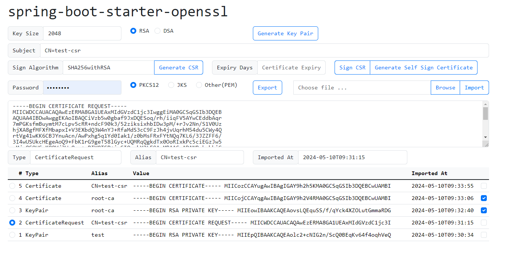

# spring-boot-starter-openssl

Spring Boot starter web application for openssl operations e.g.
- Generate Key Pair with algorithm RSA or DSA and specified Key Size
- Generate Self Signed Certificate
- Generate Certificate Signing Request
- Sign Certificate Signing Request to generate X509 Certificate
- Import from PKCS12, JKS or PEM
- Export to PKCS12, JKS or PEM

## Requirements

- [Java 17](https://www.oracle.com/pk/java/technologies/downloads/#java17)
- [Maven 3](https://maven.apache.org)

## Running the application locally

- Execute the `main` method of `io.github.meritepk.openssl.Application` class from IDE

or

- Use [Spring Boot Maven plugin](https://docs.spring.io/spring-boot/docs/current/reference/html/build-tool-plugins-maven-plugin.html) like `mvn spring-boot:run`

Open [http://localhost:8080/](http://localhost:8080/) in web browser
